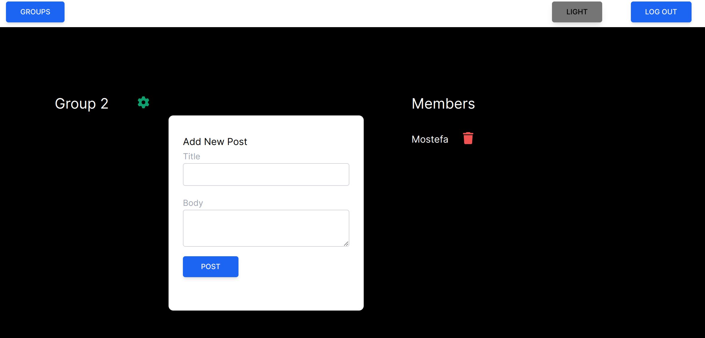

# Social Network

> This is a simple social network where you can create an account, then create, join, and leave groups. You can add posts and comments to these groups. Additionally, you have the ability to edit and delete your posts and comments. If you are the admin, you also have the ability to manage a group.


## Live demo
[Live Demo Link](https://social-network-web-app-399a54c31085.herokuapp.com/)


## Screen shots

 

## Built With

- 
- 
- 
- 
- 


### Install & Setup

To setup and install this project, follow the below steps:
- Clone this project by the command: 
  ```
  git clone https://github.com/Terbeche/social-network.git
  ```

- Then switch to the project folder by the bellow query:

  ```
  cd social-network
  ```

- Install the required dependecies with:
  ```
  bundle install
  ```
- Install npm dependencies with: 
  ```
  npm install
  ```
- Before running below commands update [config/database.yml](./config/database.yml) with your local `DB`credentials. Then run:
    ```
    rake db:create
    ```
    ```
    rake db:migrate
    ```
- To make the tailwindcss works run the below command:
    ```
    bundle exec rake assets:precompile
    ```

- With Ruby on Rails and MySQL installed in your environment, you can run `rails server` to run the website.
### Tests

- Run `bundle install`
- Run `bundle exec rspec spec`

### Prerequisites

- IDE to edit and run the code (We use Visual Studio Code 🔥).
- Git to versionning your work.
- MySQL

## Author

👤 **Terbeche Mostefa**

- GitHub: [@githubhandle](https://github.com/Terbeche)
- LinkedIn: [LinkedIn](https://www.linkedin.com/in/mustapha-terbeche/)


## 🤝 Contributing

Contributions, issues, and feature requests are welcome!

Feel free to check the [issues page](https://github.com/Terbeche/social-network/issues).


## Show your support

Give a ⭐️ if you like this project!
